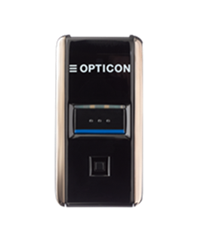
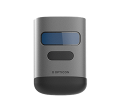

# OptiConnect SDK

OptiConnect SDK enables seamless integration with [Opticon](https://opticon.com/)'s BLE [OPN-2500](https://opticon.com/product/opn-2500/) and [OPN-6000](https://opticon.com/product/opn-6000/) barcode scanners. This SDK allows you to manage Bluetooth Low Energy (BLE) connections, handle scanner data streams, and programmatically control scanner settings via commands.

## Documentation

For comprehensive information on the SDK setup, usage, and API reference, please visit the [OptiConnect SDK Documentation](https://opticonosedevelopment.github.io/opticonnect_sdk_android/).

## Features

- Bluetooth discovery and connection management for OPN-2500 and OPN-6000 BLE scanners.
- Real-time data streaming, including barcode data reception and BLE device state monitoring.
- Programmatic control of scanner settings (e.g., scan modes, illumination, connection pooling, etc.).
- Exclusive connection management: Ensure stable device pairing in multi-device environments by assigning unique connection pool IDs, preventing previously paired devices from hijacking active connections.
- Command management and customization for BLE services and scanner configurations.

## Getting Started

### 1. Prerequisites

At least one of the following Opticon BLE barcode scanners is required:

| OPN-2500                                                                                       | OPN-6000                                                                                       |
|------------------------------------------------------------------------------------------------|------------------------------------------------------------------------------------------------|
| [](https://opticon.com/product/opn-2500/) | [](https://opticon.com/product/opn-6000/) |
| [OPN-2500](https://opticon.com/product/opn-2500/)                                              | [OPN-6000](https://opticon.com/product/opn-6000/)

### 2. System Requirements
- **Android Minimum SDK**: 26
- **Java Version**: 11 or higher
- **Kotlin Version**: 1.8.20 or higher
- **Gradle Version**: 7.4 or higher   
- **AGP (Android Gradle Plugin)**: 7.2.2 or higher 

### 3. Building the opticonnect .aar library (optional)

To build the `.aar` file for the OptiConnect SDK with shadowed dependencies, follow these steps:

1. Run the shadowJar task: `./gradlew shadowJar`
2. Package the final `.aar`: `./gradlew bundleShadowedReleaseAar`

The generated `.aar` file will be located in `build/outputs/aar/`.

### 4. Adding the `.aar` library to your project

The .aar file (`opticonnectsdk.aar`) is provided at the [following location](https://github.com/OpticonOSEDevelopment/opticonnect_sdk_android/tree/main/libs). The library is already included in both the Kotlin and Java examples in their libs directories. To integrate the library into your own project, perform the following steps:

1. Copy `opticonnectsdk.aar` to your project’s libs directory if it’s not already there.
2. Add the .aar file to your dependencies in build.gradle(.kts) as explained in the following section.

### 5. Updating your `build.gradle(.kts)`

Add the `.aar` file and required dependencies to your `build.gradle(.kts)` file under `dependencies`. Below is the recommended setup:

#### Shared Dependencies for Java and Kotlin Projects

```kotlin
dependencies {
    // Include the .aar file
    implementation(files("libs/opticonnectsdk.aar"))

    // Core Android dependencies
    implementation(libs.androidx.core.ktx)
    implementation(libs.androidx.lifecycle.runtime.ktx)

    // RxAndroidBLE and RxKotlin for BLE and reactive programming
    implementation(libs.rxandroidble)
    implementation(libs.rxkotlin)
}
```

#### Additional Kotlin Dependencies

If using Kotlin, add the Coroutines libraries for asynchronous handling:

```kotlin
dependencies {
    // Coroutines dependencies
    implementation(libs.coroutines)
    implementation(libs.coroutines.android)
    implementation(libs.coroutines.rx3)
}
```

- Note: Java projects do not require Coroutines as they use callbacks instead of coroutines for asynchronous handling.

#### Important: Kotlin Plugin Requirement for Java Projects

The Kotlin plugin is necessary even for Java-based projects due to the Kotlin-based .aar library. This ensures compatibility with any Kotlin classes or extensions within the SDK.

### 6. Android Manifest Bluetooth Permissions

To enable Bluetooth discovery and connection on Android, add the following permissions to your AndroidManifest.xml file located at android/app/src/main/AndroidManifest.xml below the manifest entry:

```xml
<uses-feature android:name="android.hardware.bluetooth_le" android:required="false" />

<!-- New Bluetooth permissions for Android 12 or higher -->
<uses-permission android:name="android.permission.BLUETOOTH_SCAN"/>
<uses-permission android:name="android.permission.BLUETOOTH_CONNECT" />
<uses-permission android:name="android.permission.ACCESS_FINE_LOCATION" />

<!-- Legacy permissions for Android 11 or lower -->
<uses-permission android:name="android.permission.BLUETOOTH" android:maxSdkVersion="30" />
<uses-permission android:name="android.permission.BLUETOOTH_ADMIN" android:maxSdkVersion="30" />

<!-- Legacy permission for Android 9 or lower -->
<uses-permission android:name="android.permission.ACCESS_COARSE_LOCATION" android:maxSdkVersion="28" />
```

## Examples

These examples demonstrate how to integrate the OptiConnect SDK to discover devices, manage Bluetooth connections, retrieve barcode data, and monitor battery status for the OPN-2500 and OPN-6000 in both Kotlin and Java.

#### Main Components in the Example
- **DeviceState**: A data class managing the state of the connected BLE scanner, including device ID, connection state, barcode data, battery percentage, and charging status.
- **MainActivity**:  The main activity for setting up the SDK, handling Bluetooth permissions, discovering devices, managing connection and disconnection events, and starting listeners for barcode data and battery updates.
#### User Interfaces
- **Kotlin (Compose)**: `ConnectionStatusScreen` displays the connection status, barcode data, battery level, and charging state in a simple Compose layout.
- **Java (XML Layout)**: `activity_main.xml` provides a similar UI using TextView components to display the connection status, barcode data, battery level, and charging state, along with a "Disconnect" button.

### Kotlin Example

This example demonstrates how to integrate the OptiConnect SDK using Kotlin. It is available in [examples/kotlin](https://github.com/OpticonOSEDevelopment/opticonnect_sdk_android/tree/main/examples/kotlin).

*MainActivity.kt*

```Kotlin
package com.opticon.opticonnect_sdk_example

import android.Manifest
import android.content.pm.PackageManager
import android.os.Build
import android.os.Bundle
import android.util.Log
import android.widget.Toast
import androidx.activity.ComponentActivity
import androidx.activity.compose.setContent
import androidx.activity.result.contract.ActivityResultContracts
import androidx.compose.foundation.layout.*
import androidx.compose.material3.*
import androidx.compose.runtime.*
import androidx.compose.ui.Modifier
import androidx.compose.ui.unit.dp
import androidx.core.content.ContextCompat
import androidx.lifecycle.lifecycleScope
import com.opticon.opticonnect.sdk.api.OptiConnect
import com.opticon.opticonnect.sdk.api.enums.BleDeviceConnectionState
import com.opticon.opticonnect_sdk_example.ui.theme.Opticonnect_SDK_ExampleTheme
import kotlinx.coroutines.launch

// Holds device-specific connection and data state
data class DeviceState(
    val connectedDeviceId: String = "",
    val connectionState: BleDeviceConnectionState = BleDeviceConnectionState.DISCONNECTED,
    val barcodeData: String? = null,
    val batteryPercentage: Int? = null,
    val isCharging: Boolean? = null
)

class MainActivity : ComponentActivity() {
    private var deviceState by mutableStateOf(DeviceState())

    override fun onCreate(savedInstanceState: Bundle?) {
        super.onCreate(savedInstanceState)
        setContent { MainScreen() }
        checkBluetoothPermissions()
    }

    // Sets up the main UI screen
    @Composable
    private fun MainScreen() {
        Opticonnect_SDK_ExampleTheme {
            Surface(
                modifier = Modifier.fillMaxSize(),
                color = MaterialTheme.colorScheme.background
            ) {
                ConnectionStatusScreen(deviceState) { disconnectDevice(it) }
            }
        }
    }

    // Checks for required Bluetooth permissions and requests them if not granted
    private fun checkBluetoothPermissions() {
        val permissions = if (Build.VERSION.SDK_INT >= Build.VERSION_CODES.S) {
            listOf(Manifest.permission.BLUETOOTH_SCAN, Manifest.permission.BLUETOOTH_CONNECT)
        } else listOf(Manifest.permission.ACCESS_FINE_LOCATION)

        val toRequest = permissions.filter {
            ContextCompat.checkSelfPermission(this, it) != PackageManager.PERMISSION_GRANTED
        }

        if (toRequest.isNotEmpty()) {
            requestPermissionsLauncher.launch(toRequest.toTypedArray())
        } else initializeOptiConnectAndStartDiscovery()
    }

    // Launcher for permission requests
    private val requestPermissionsLauncher = registerForActivityResult(
        ActivityResultContracts.RequestMultiplePermissions()
    ) { permissions ->
        if (permissions.all { it.value }) initializeOptiConnectAndStartDiscovery()
        else Toast.makeText(this, "Bluetooth permissions are required.", Toast.LENGTH_LONG).show()
    }

    // Initializes OptiConnect SDK and starts device discovery
    private fun initializeOptiConnectAndStartDiscovery() {
        OptiConnect.initialize(this).apply {
            OptiConnect.bluetoothManager.startDiscovery()
            lifecycleScope.launch {
                // Collects discovered devices and connects if disconnected
                OptiConnect.bluetoothManager.listenToDiscoveredDevices.collect { device ->
                    if (deviceState.connectionState == BleDeviceConnectionState.DISCONNECTED) {
                        deviceState = deviceState.copy(
                            connectedDeviceId = device.deviceId,
                            connectionState = BleDeviceConnectionState.CONNECTING
                        )
                        connectToDevice(device.deviceId)
                    }
                }
            }
        }
    }

    // Connects to the discovered device
    private fun connectToDevice(deviceId: String) {
        lifecycleScope.launch {
            OptiConnect.bluetoothManager.apply {
                try {
                    // Initiates the connection and listens to connection state
                    connect(deviceId)
                    startListeningToDeviceData(deviceId)

                    listenToConnectionState(deviceId).collect { state ->
                        deviceState = deviceState.copy(
                            connectionState = state,
                            connectedDeviceId = if (state == BleDeviceConnectionState.CONNECTED) deviceId else ""
                        )

                        Log.d("OptiConnect", "Device $deviceId state changed to: $state")

                        if (state == BleDeviceConnectionState.DISCONNECTED) {
                            deviceState = DeviceState() // Reset state on disconnect
                        }
                    }
                } catch (e: Exception) {
                    // Handle connection failure and reset device state
                    Toast.makeText(this@MainActivity, "Failed to connect: ${e.message}", Toast.LENGTH_SHORT).show()
                    deviceState = DeviceState()
                }
            }
        }
    }

    // Listens to data from the connected device (barcode, battery, charging status)
    private fun startListeningToDeviceData(deviceId: String) {
        lifecycleScope.launch {
            OptiConnect.bluetoothManager.listenToBarcodeData(deviceId).collect { barcode ->
                deviceState = deviceState.copy(barcodeData = barcode.data)
            }
        }

        lifecycleScope.launch {
            OptiConnect.bluetoothManager.listenToBatteryPercentage(deviceId).collect { battery ->
                deviceState = deviceState.copy(batteryPercentage = battery)
            }
        }

        lifecycleScope.launch {
            OptiConnect.bluetoothManager.listenToBatteryStatus(deviceId).collect { status ->
                deviceState = deviceState.copy(isCharging = status.isCharging)
            }
        }
    }

    // Disconnects from the device and resets the state
    private fun disconnectDevice(deviceId: String) {
        lifecycleScope.launch {
            OptiConnect.bluetoothManager.disconnect(deviceId)
            deviceState = DeviceState()
        }
    }

    override fun onDestroy() {
        super.onDestroy()
        OptiConnect.close()
    }
	
}

// UI for showing the connection status and device data
 @Composable
fun ConnectionStatusScreen(
    connectionState: DeviceState,
    onDisconnect: (String) -> Unit
) {
    Surface(
        modifier = Modifier.fillMaxSize(),
        color = MaterialTheme.colorScheme.background
    ) {
        Column(
            modifier = Modifier
                .padding(16.dp)
                .fillMaxSize()
        ) {
            when (connectionState.connectionState) {
                BleDeviceConnectionState.CONNECTING -> {
                    Text(
                        text = "Connecting to device...",
                        style = MaterialTheme.typography.headlineMedium
                    )
                    CircularProgressIndicator(
                        modifier = Modifier.padding(top = 16.dp)
                    )
                }
                BleDeviceConnectionState.CONNECTED -> {
                    Text(
                        text = "Connected to device: ${connectionState.connectedDeviceId}",
                        style = MaterialTheme.typography.headlineMedium
                    )
                    Text(
                        text = "Barcode Data: ${connectionState.barcodeData ?: "No barcode scanned yet."}"
                    )
                    Text(
                        text = "Battery: ${connectionState.batteryPercentage ?: "N/A"}%"
                    )
                    Text(
                        text = "Charging: ${if (connectionState.isCharging == true) "Yes" else "No"}"
                    )
                    Button(
                        onClick = { onDisconnect(connectionState.connectedDeviceId) },
                        modifier = Modifier.padding(top = 16.dp)
                    ) {
                        Text("Disconnect")
                    }
                }
                BleDeviceConnectionState.DISCONNECTED -> {
                    Text(
                        text = "Searching for devices...",
                        style = MaterialTheme.typography.headlineMedium
                    )
                }
                BleDeviceConnectionState.DISCONNECTING -> {
                    Text(
                        text = "Disconnecting from device...",
                        style = MaterialTheme.typography.headlineMedium
                    )
                }
            }
        }
    }
}
```

### Java Example

This example demonstrates how to integrate the OptiConnect SDK using Java. It is available in It is available in [examples/java](https://github.com/OpticonOSEDevelopment/opticonnect_sdk_android/tree/main/examples/java).

*DeviceState.java*

```java
package com.example.opticonnect_sdk_example_java;

import com.opticon.opticonnect.sdk.api.enums.BleDeviceConnectionState;

public class DeviceState {
    private String connectedDeviceId = "";
    private BleDeviceConnectionState connectionState = BleDeviceConnectionState.DISCONNECTED;
    private String barcodeData = null;
    private Integer batteryPercentage = null;
    private Boolean isCharging = null;

    // Simplified getters and setters
    public String getConnectedDeviceId() { return connectedDeviceId; }
    public void setConnectedDeviceId(String id) { this.connectedDeviceId = id; }

    public BleDeviceConnectionState getConnectionState() { return connectionState; }
    public void setConnectionState(BleDeviceConnectionState state) { this.connectionState = state; }

    public String getBarcodeData() { return barcodeData; }
    public void setBarcodeData(String data) { this.barcodeData = data; }

    public Integer getBatteryPercentage() { return batteryPercentage; }
    public void setBatteryPercentage(Integer percentage) { this.batteryPercentage = percentage; }

    public Boolean getIsCharging() { return isCharging; }
    public void setIsCharging(Boolean isCharging) { this.isCharging = isCharging; }
}
```

*MainActivity.java*

```java
package com.example.opticonnect_sdk_example_java;

import android.Manifest;
import android.content.pm.PackageManager;
import android.os.Build;
import android.os.Bundle;
import android.util.Log;
import android.widget.Button;
import android.widget.TextView;
import android.widget.Toast;

import androidx.activity.ComponentActivity;
import androidx.activity.result.ActivityResultLauncher;
import androidx.activity.result.contract.ActivityResultContracts;
import androidx.annotation.NonNull;
import androidx.core.content.ContextCompat;

import com.opticon.opticonnect.sdk.api.OptiConnect;
import com.opticon.opticonnect.sdk.api.entities.BarcodeData;
import com.opticon.opticonnect.sdk.api.entities.BatteryLevelStatus;
import com.opticon.opticonnect.sdk.api.entities.BleDiscoveredDevice;
import com.opticon.opticonnect.sdk.api.enums.BleDeviceConnectionState;
import com.opticon.opticonnect.sdk.api.interfaces.Callback;

import kotlin.Unit;

public class MainActivity extends ComponentActivity {

    private DeviceState deviceState = new DeviceState();
    private TextView connectionStatusText, barcodeDataText, batteryPercentageText, chargingStatusText;

    private final ActivityResultLauncher<String[]> requestPermissionsLauncher =
            registerForActivityResult(new ActivityResultContracts.RequestMultiplePermissions(), this::onPermissionsResult);

    @Override
    protected void onCreate(Bundle savedInstanceState) {
        super.onCreate(savedInstanceState);
        setContentView(R.layout.activity_main);

        // Bind UI elements
        connectionStatusText = findViewById(R.id.connectionStatusText);
        barcodeDataText = findViewById(R.id.barcodeDataText);
        batteryPercentageText = findViewById(R.id.batteryPercentageText);
        chargingStatusText = findViewById(R.id.chargingStatusText);
        Button disconnectButton = findViewById(R.id.disconnectButton);

        disconnectButton.setOnClickListener(view -> disconnectDevice());

        checkBluetoothPermissions();
    }

    private void checkBluetoothPermissions() {
        String[] permissions = Build.VERSION.SDK_INT >= Build.VERSION_CODES.S
                ? new String[]{Manifest.permission.BLUETOOTH_SCAN, Manifest.permission.BLUETOOTH_CONNECT}
                : new String[]{Manifest.permission.ACCESS_FINE_LOCATION};

        boolean permissionsGranted = true;
        for (String permission : permissions) {
            permissionsGranted &= ContextCompat.checkSelfPermission(this, permission) == PackageManager.PERMISSION_GRANTED;
        }

        if (permissionsGranted) {
            initializeOptiConnectAndStartDiscovery();
        } else {
            requestPermissionsLauncher.launch(permissions);
        }
    }

    private void onPermissionsResult(@NonNull java.util.Map<String, Boolean> permissions) {
        if (permissions.containsValue(Boolean.FALSE)) {
            Toast.makeText(this, "Bluetooth permissions are required.", Toast.LENGTH_LONG).show();
        } else {
            initializeOptiConnectAndStartDiscovery();
        }
    }

    private void initializeOptiConnectAndStartDiscovery() {
        OptiConnect.INSTANCE.initialize(this);
        OptiConnect.INSTANCE.getBluetoothManager().startDiscovery();

        OptiConnect.INSTANCE.getBluetoothManager().listenToDiscoveredDevices(new Callback<>() {
            @Override
            public void onSuccess(BleDiscoveredDevice device) {
                if (deviceState.getConnectionState() == BleDeviceConnectionState.DISCONNECTED) {
                    deviceState.setConnectedDeviceId(device.getDeviceId());
                    deviceState.setConnectionState(BleDeviceConnectionState.CONNECTING);
                    updateUI();
                    connectToDevice(device.getDeviceId());
                }
            }

            @Override
            public void onError(@NonNull Throwable error) {
                Log.e("OptiConnect", "Error discovering devices: " + error.getMessage());
            }
        });
    }

    private void connectToDevice(String deviceId) {
        OptiConnect.INSTANCE.getBluetoothManager().connect(deviceId, new Callback<>() {
            @Override
            public void onSuccess(Unit result) {
                deviceState.setConnectionState(BleDeviceConnectionState.CONNECTED);
                updateUI();
                startListeningToDeviceData(deviceId);
                listenToConnectionState(deviceId);
            }

            @Override
            public void onError(@NonNull Throwable error) {
                Toast.makeText(MainActivity.this, "Failed to connect: " + error.getMessage(), Toast.LENGTH_SHORT).show();
                deviceState = new DeviceState();
            }
        });
    }

    private void startListeningToDeviceData(String deviceId) {
        OptiConnect.INSTANCE.getBluetoothManager().listenToBarcodeData(deviceId, new Callback<>() {
            @Override
            public void onSuccess(BarcodeData barcode) {
                deviceState.setBarcodeData(barcode.getData());
                updateUI();
            }

            @Override
            public void onError(@NonNull Throwable error) {
                Log.e("OptiConnect", "Error receiving barcode data: " + error.getMessage());
            }
        });

        OptiConnect.INSTANCE.getBluetoothManager().listenToBatteryPercentage(deviceId, new Callback<>() {
            @Override
            public void onSuccess(Integer batteryPercentage) {
                deviceState.setBatteryPercentage(batteryPercentage);
                updateUI();
            }

            @Override
            public void onError(@NonNull Throwable error) {
                Log.e("OptiConnect", "Error receiving battery percentage: " + error.getMessage());
            }
        });

        OptiConnect.INSTANCE.getBluetoothManager().listenToBatteryStatus(deviceId, new Callback<>() {
            @Override
            public void onSuccess(BatteryLevelStatus status) {
                deviceState.setIsCharging(status.isCharging());
                updateUI();
            }

            @Override
            public void onError(@NonNull Throwable error) {
                Log.e("OptiConnect", "Error receiving battery status: " + error.getMessage());
            }
        });
    }

    private void listenToConnectionState(String deviceId) {
        OptiConnect.INSTANCE.getBluetoothManager().listenToConnectionState(deviceId, new Callback<>() {
            @Override
            public void onSuccess(BleDeviceConnectionState state) {
                deviceState.setConnectionState(state);
                updateUI();
            }

            @Override
            public void onError(@NonNull Throwable error) {
                Log.e("OptiConnect", "Error receiving connection state: " + error.getMessage());
            }
        });
    }

    private void disconnectDevice() {
        // Reset DeviceState and update UI
        deviceState = new DeviceState();
        updateUI();
    }

    private void updateUI() {
        connectionStatusText.setText("Status: " + deviceState.getConnectionState().name());

        // Set color based on connection state
        switch (deviceState.getConnectionState()) {
            case CONNECTING:
                connectionStatusText.setTextColor(ContextCompat.getColor(this, R.color.connecting_color));
                break;
            case CONNECTED:
                connectionStatusText.setTextColor(ContextCompat.getColor(this, R.color.connected_color));
                break;
            case DISCONNECTED:
                connectionStatusText.setTextColor(ContextCompat.getColor(this, R.color.disconnected_color));
                break;
            default:
                connectionStatusText.setTextColor(ContextCompat.getColor(this, R.color.text_primary));
        }

        barcodeDataText.setText("Barcode Data: " + (deviceState.getBarcodeData() != null ? deviceState.getBarcodeData() : "None"));
        batteryPercentageText.setText("Battery: " + (deviceState.getBatteryPercentage() != null ? deviceState.getBatteryPercentage() + "%" : "N/A"));
        chargingStatusText.setText("Charging: " + (deviceState.getIsCharging() != null ? (deviceState.getIsCharging() ? "Yes" : "No") : "Unknown"));
    }
}
```

*res/values/colors.xml*

```xml
<?xml version="1.0" encoding="utf-8"?>
<resources>
    <color name="background_color">#FFFFFF</color> <!-- White background -->
    <color name="text_primary">#000000</color>     <!-- Black primary text -->
    <color name="text_secondary">#666666</color>   <!-- Gray secondary text -->
    <color name="button_color">#6200EE</color>     <!-- Purple button color -->
    <color name="connecting_color">#FFA500</color> <!-- Orange for "Connecting" -->
    <color name="connected_color">#00FF00</color>  <!-- Green for "Connected" -->
    <color name="disconnected_color">#FF0000</color> <!-- Red for "Disconnected" -->
</resources>
```

*res/layout/activity_main.xml*

```xml
<!-- res/layout/activity_main.xml -->
<LinearLayout
    xmlns:android="http://schemas.android.com/apk/res/android"
    android:orientation="vertical"
    android:layout_width="match_parent"
    android:layout_height="match_parent"
    android:background="@color/background_color"
    android:padding="16dp">

    <TextView
        android:id="@+id/connectionStatusText"
        android:layout_width="wrap_content"
        android:layout_height="wrap_content"
        android:text="Status: Disconnected"
        android:textColor="@color/disconnected_color"
        android:textSize="18sp"/>

    <TextView
        android:id="@+id/barcodeDataText"
        android:layout_width="wrap_content"
        android:layout_height="wrap_content"
        android:text="Barcode Data: None"
        android:textColor="@color/text_primary"
        android:textSize="16sp"/>

    <TextView
        android:id="@+id/batteryPercentageText"
        android:layout_width="wrap_content"
        android:layout_height="wrap_content"
        android:text="Battery: N/A"
        android:textColor="@color/text_secondary"
        android:textSize="16sp"/>

    <TextView
        android:id="@+id/chargingStatusText"
        android:layout_width="wrap_content"
        android:layout_height="wrap_content"
        android:text="Charging: Unknown"
        android:textColor="@color/text_secondary"
        android:textSize="16sp"/>

    <Button
        android:id="@+id/disconnectButton"
        android:layout_width="wrap_content"
        android:layout_height="wrap_content"
        android:text="Disconnect"
        android:textColor="@android:color/white"
        android:backgroundTint="@color/button_color"
        android:layout_marginTop="16dp"/>
</LinearLayout>
```
