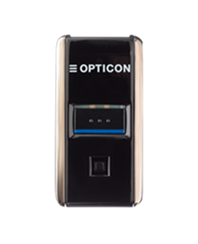
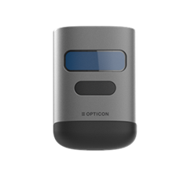

# Module opticonnect sdk

OptiConnect SDK enables seamless integration with [Opticon](https://opticon.com/)'s BLE [OPN-2500](https://opticon.com/product/opn-2500/) and [OPN-6000](https://opticon.com/product/opn-6000/) barcode scanners. This SDK allows you to manage Bluetooth Low Energy (BLE) connections, handle scanner data streams, and programmatically control scanner settings via commands.

## Features

- Bluetooth discovery and connection management for OPN-2500 and OPN-6000 BLE scanners.
- Real-time data streaming, including barcode data reception and BLE device state monitoring.
- Programmatic control of scanner settings (e.g., scan modes, illumination, connection pooling, etc.).
- Exclusive connection management: Ensure stable device pairing in multi-device environments by assigning unique connection pool IDs, preventing previously paired devices from hijacking active connections.
- Command management and customization for BLE services and scanner configurations.

## Getting Started

### 1. Prerequisites

At least one of the following Opticon BLE barcode scanners is required:

<table style="width: 100%; text-align: center; table-layout: fixed; margin-top: 10px;">
    <tr>
        <td style="width: 50%; border: 1px solid #ddd; border-radius: 8px; padding: 10px; box-shadow: 0px 2px 8px rgba(0, 0, 0, 0.1); vertical-align: middle;">
            <div style="display: flex; flex-direction: column; align-items: center; height: 200px; position: relative;">
                <div style="flex-grow: 1; display: flex; align-items: center; justify-content: center;">                    
					
                </div>
                <div style="position: absolute; bottom: 0px; font-weight: bold;">
                    <a href="https://opticon.com/product/opn-2500/" target="_blank" style="text-decoration: none; color: inherit;">OPN-2500</a>
                </div>
            </div>
        </td>
        <td style="width: 50%; border: 1px solid #ddd; border-radius: 8px; padding: 10px; box-shadow: 0px 2px 8px rgba(0, 0, 0, 0.1); vertical-align: middle;">
            <div style="display: flex; flex-direction: column; align-items: center; height: 200px; position: relative;">
                <div style="flex-grow: 1; display: flex; align-items: center; justify-content: center;">                    
					
                </div>
                <div style="position: absolute; bottom: 0px; font-weight: bold;">
                    <a href="https://opticon.com/product/opn-6000/" target="_blank" style="text-decoration: none; color: inherit;">OPN-6000</a>
                </div>
            </div>
        </td>
    </tr>
</table>

### 2. System Requirements
- **Android Minimum SDK**: 26
- **Compile SDK**: 36
- **Android Build Tools**: 36.0.0
- **JDK Version for building**: 17
- **Gradle Wrapper**: 8.13
- **Kotlin/AGP**: use the versions pinned in `gradle/libs.versions.toml`
- **Runtime target**: apps can support Android 8.0+ as long as `minSdk` stays at 26 or lower APIs are explicitly tested

### 3. Building the opticonnect .aar library (optional)

To build the `.aar` file for the OptiConnect SDK with shadowed dependencies, run:

```bash
./gradlew :opticonnectsdk:bundleShadowedReleaseAar
```

On Windows, run the same task with:

```powershell
.\gradlew.bat :opticonnectsdk:bundleShadowedReleaseAar
```

This task builds the SDK, creates the relocated `classes.jar`, and packages the final AAR.
The generated file will be located at `opticonnectsdk/build/outputs/aar/opticonnectsdk.aar`.

The shaded AAR intentionally relocates SDK-internal dependencies such as Room, Dagger, SQLite, and Timber to reduce conflicts with the host app. External runtime/API dependencies such as Kotlin, coroutines, RxAndroidBLE, and RxKotlin should remain normal app dependencies so the host app can control those versions.

### 4. Adding the `.aar` library to your project

The .aar file (`opticonnectsdk.aar`) is provided at the [following location](https://github.com/OpticonOSEDevelopment/opticonnect_sdk_android/tree/main/libs). The library is already included in both the Kotlin and Java examples in their libs directories. To integrate the library into your own project, perform the following steps:

1. Copy `opticonnectsdk.aar` to your project’s libs directory if it’s not already there.
2. Add the .aar file to your dependencies in build.gradle(.kts) as explained in the following section.

### 5. Updating your `build.gradle(.kts)`

Add the `.aar` file and required dependencies to your `build.gradle(.kts)` file under `dependencies`. Below is the recommended setup:

#### Shared Dependencies for Java and Kotlin Projects

```kotlin
dependencies {
    // Include the .aar file
    implementation(files("libs/opticonnectsdk.aar"))

    // Required external dependencies not bundled into the shaded AAR
    implementation("androidx.core:core:1.17.0")
    implementation("com.polidea.rxandroidble3:rxandroidble:1.19.1")
    implementation("io.reactivex.rxjava3:rxkotlin:3.0.1")

    // Required by the SDK runtime and Kotlin Flow-based APIs
    implementation("org.jetbrains.kotlinx:kotlinx-coroutines-core:1.11.0")
    implementation("org.jetbrains.kotlinx:kotlinx-coroutines-android:1.11.0")
    implementation("org.jetbrains.kotlinx:kotlinx-coroutines-rx3:1.11.0")
}
```

Java projects can use the callback APIs, but the app should still include the coroutine dependencies because the SDK runtime and public API use coroutines internally. Long-running callback listeners return a `ListenerSubscription`; call `close()` when the screen or generated workflow no longer needs discovery, connection-state, barcode, or battery updates.

#### Important: Kotlin Plugin Requirement for Java Projects

The Kotlin plugin is necessary even for Java-based projects due to the Kotlin-based .aar library. This ensures compatibility with any Kotlin classes or extensions within the SDK.

### 6. Android Manifest Bluetooth Permissions

To enable Bluetooth discovery and connection on Android, add the following permissions to your AndroidManifest.xml file located at android/app/src/main/AndroidManifest.xml below the manifest entry:

```xml
<uses-feature android:name="android.hardware.bluetooth_le" android:required="false" />

<!-- Android 12+ Bluetooth permissions. Use neverForLocation only if scan results are not used to derive physical location. -->
<uses-permission
    android:name="android.permission.BLUETOOTH_SCAN"
    android:usesPermissionFlags="neverForLocation" />
<uses-permission android:name="android.permission.BLUETOOTH_CONNECT" />

<!-- Legacy permissions for Android 11 or lower -->
<uses-permission android:name="android.permission.BLUETOOTH" android:maxSdkVersion="30" />
<uses-permission android:name="android.permission.BLUETOOTH_ADMIN" android:maxSdkVersion="30" />
<uses-permission android:name="android.permission.ACCESS_FINE_LOCATION" android:maxSdkVersion="30" />

<!-- Legacy permission for Android 9 or lower -->
<uses-permission android:name="android.permission.ACCESS_COARSE_LOCATION" android:maxSdkVersion="28" />
```

The host app is responsible for requesting the required runtime permissions before starting discovery or connecting to a scanner. The SDK handles the scanner protocol and BLE connection flow, but it does not show permission prompts on behalf of the app.

At runtime, request `BLUETOOTH_SCAN` and `BLUETOOTH_CONNECT` on Android 12+ (API 31+). On Android 11 and lower, request `ACCESS_FINE_LOCATION` before scanning.

## Examples

Complete working examples are available in the repository:

- [Kotlin example app](https://github.com/OpticonOSEDevelopment/opticonnect_sdk_android/tree/main/examples/kotlin): simple Compose app for discovery, connection, barcode data, battery percentage, charging state, and disconnect.
- [Advanced Kotlin example app](https://github.com/OpticonOSEDevelopment/opticonnect_sdk_android/tree/main/examples/kotlin-advanced): manual scanner list with per-device connect/disconnect controls, live barcode and battery fields, and a scanner setting toggle.
- [Java example app](https://github.com/OpticonOSEDevelopment/opticonnect_sdk_android/tree/main/examples/java): Java/XML app using callback APIs and explicit listener cleanup.

For the shortest copyable integration snippets, see the [README](https://github.com/OpticonOSEDevelopment/opticonnect_sdk_android/blob/main/README.md).
